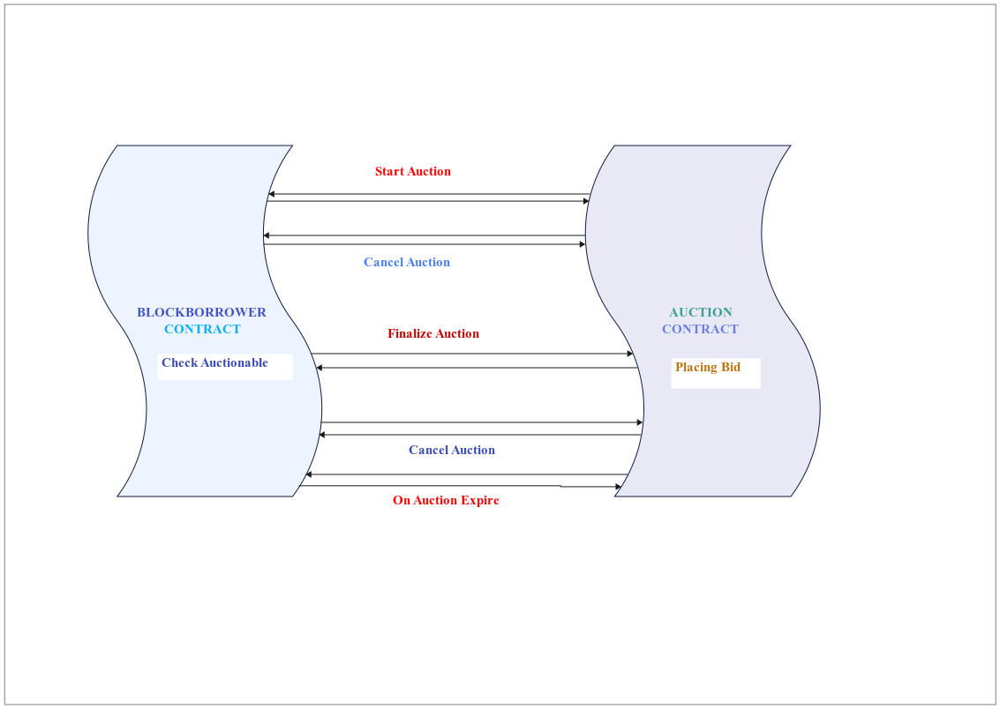

# Smart contract collection for DeFi Lending

## Block Borrower Smart contract

### Introduction
The `BlockBorrower` smart contract, implemented in Solidity, facilitates a range of decentralized finance (DeFi) activities. It enables the creation and management of banks, handling of loans with NFTs as collateral, and the execution of auctions in the event of loan defaults.

### Architecture

### Key Features

#### Bank Management
- **createBank**: Allows for the creation of a new bank with specified parameters such as interest rate, tenure, and loan percentage.
- **joinBank**: Enables users to join a bank as lenders by depositing a certain amount.
- **depositToBank**: Facilitates additional fund deposits by lenders into the bank.
- **withdrawBalance**: Permits lenders to withdraw their funds from the bank.
- **setInterestRate**: Bank admins can adjust the bank's interest rate.
- **setTenure**: Bank admins are enabled to modify the loan tenure.
- **LeaveBank**: Allows lenders to exit a bank under specific conditions.
- **closeBank**: Bank admins can shut down a bank, contingent on certain criteria.

#### Loan and NFT Management
- **depositNFT**: Users can deposit NFTs as collateral to secure loans.
- **withdrawNFT**: Users can retrieve their NFTs post loan repayment or closure.
- **repayEmi**: Facilitates loan EMI repayments by users.
- **claimBalanceFromLoan**: Users can claim any remaining balance post-loan repayment.

#### Auction Management
- **startAuction**: Enables lenders to initiate an auction for a defaulted loan.
- **finalizeAuctionBeforeTime**: Lenders can conclude an auction ahead of schedule.
- **checkIfAuctionHasExpired**: Checks if an auction has expired and takes necessary action.
- **cancelAuctionBeforeTime**: Permits lenders to cancel an auction before its due time.

#### Utility Functions
- **checkIfAuctionable**: Verifies the eligibility of a loan for auction.
- **isLoanClosed**: Checks the closure status of a loan.
- **apportionProfitOrLoss**: Distributes profit or loss among lenders.

#### View Functions
- **getAllCustomersOfBank**: Retrieves all customers of a particular bank.
- **getAllLendersOfBank**: Acquires a list of all lenders in a bank.
- **getAllNftDepositsOfBank**: Lists all NFT deposits of a user in a bank.
- **getMyBankBalance**: Provides a user's balance in a bank.
- **getStatusOfLender**: Displays a lender's status in a bank.
- **getTotalNumberOfBanks**: Counts the total number of banks.
- **getRepaymentSchedules**: Fetches a loan's repayment schedule.
- **calculateDues**: Calculates the dues owed for a loan.

## Auction Smart Contract

### Introduction
The `Auction` smart contract, implemented in Solidity, is designed to manage auctions for NFTs used as collateral in loans. It facilitates the entire auction process, including starting, finalizing, and canceling auctions, as well as placing bids.

### Key Features

#### Auction Management
- **startAuction**: Initiates an auction for an NFT used as loan collateral.
- **blackListUsersFromAuction**: Prevents specific users (such as bank lenders) from participating in the auction.
- **finalizeAuctionBeforeTime**: Finalizes an ongoing auction ahead of its scheduled completion.
- **cancelAuctionBeforeTime**: Cancels an ongoing auction before its scheduled end.
- **checkIfAuctionHasExpired**: Checks if the auction time has expired and concludes it accordingly.
- **takeAuctionDecision**: Internally used to decide the auction outcome, transferring the NFT to the highest bidder or retaining it with the bank.
- **withdrawMoney**: Allows users to withdraw their bids from concluded auctions.
- **placeBidForAuction**: Enables users to place bids on an active auction.

#### Utility Functions
- **getAllAuctionIdsForLoanId**: Retrieves all auction IDs associated with a specific loan ID.
- **getAllBiddersList**: Lists all bidders participating in a specific auction.
- **getUsersBidValueForAuctionId**: Fetches the bid value placed by a user in a specific auction.
- **bidderAlreadyExistsInBiddersList**: Checks if a bidder has already placed a bid in an auction.

## Minter Smart Contract

### Introduction
The `Minter` smart contract is designed for the minting and management of Non-Fungible Tokens (NFTs) on the Ethereum blockchain. It extends the ERC721 standard and provides functionalities for minting NFTs, initiating and finalizing burns, and managing NFT details.

### Architecture

### Key Features

#### NFT Management
- **startMintNFT**: Initiates the minting process for a new NFT.
- **sendBackNFT**: Prepares an NFT for transfer back to its original chain by initiating the burn process.
- **finalizeBurn**: Finalizes the burning of an NFT, effectively removing it from the blockchain.
- **revertBurn**: Reverses the burn initiation process if needed, transferring the NFT back to its original owner.

#### Utility Functions
- **mintNFT**: Internal function for minting a new NFT.
- **_transfer**: Overrides the ERC721 `_transfer` function to handle custom transfer logic.

#### Events
- **BurnInitiated**: Emitted when the burn process for an NFT is initiated.
- **Burned**: Emitted when an NFT burn is finalized.
- **Minted**: Emitted when a new NFT is minted.
- **RevertedBurn**: Emitted when an NFT burn is reverted.

#### Access Control
- **onlyOwner**: A modifier to restrict certain functions to the contract owner.

## Locker Smart Contract

### Introduction
The `Locker` smart contract, built on Solidity, is focused on managing the locking and unlocking process of Non-Fungible Tokens (NFTs). It facilitates secure NFT transfers across different blockchains by locking them into the contract until they are ready to be withdrawn or unlocked.

### Key Features

#### NFT Locking and Unlocking
- **sendNFT**: Initiates the process of locking an NFT into the contract.
- **finalizeLocking**: Finalizes the locking of an NFT, marking it as locked.
- **finalizeUnlocking**: Finalizes the unlocking process, preparing the NFT for withdrawal.
- **fallbackUnlocking**: Provides a fallback mechanism for unlocking NFTs in special cases.
- **withdrawNFT**: Allows NFT owners to withdraw their NFTs once unlocked.

#### Utility Functions
- **checkIfTokenExists**: Checks if a specific token exists within the contract.
- **checkIfNFTContractExists**: Verifies if a specific NFT contract address is registered in the contract.

#### Events
- **LockedNFT**: Emitted when an NFT is successfully locked.
- **UnlockedNFT**: Emitted when an NFT is unlocked.
- **WithdrawnNFT**: Emitted when an NFT is withdrawn from the contract.

#### Access Control
- **onlyOwner**: A modifier that restricts certain functions to the contract owner.

## Technology Stack
- Solidity for smart contract development.
- OpenZeppelin contracts for ERC721 (NFT) implementations.